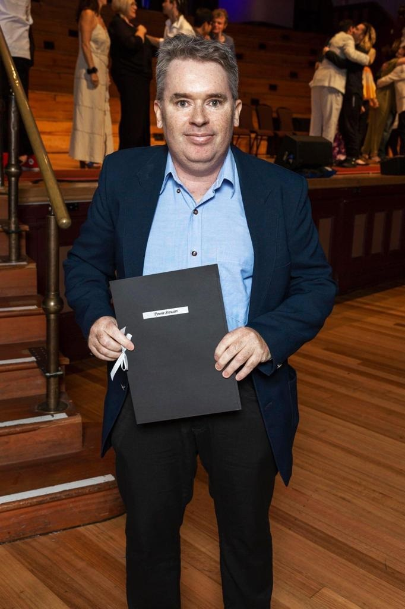

Received my Diploma in **Screen Production (Level 5)** from the [Yoobee School of Film](https://www.yoobee.ac.nz/).
This full-time course earned me 120 credits. Looking back, they were 40 weeks of very hard work, covering most of what one would need to know to get into the industry. I found myself consentrating my efforts mostly on film editing.

Adobe Premiere became a tool of choice. I remember spending many months glued to the keyboard perfecting every edit. Other tools that I grew found of were Photoshop and After Effects.

## Software to get the job done these days

1. Adobe Premiere
2. Adobe Photoshop
3. Adobe After Effects
